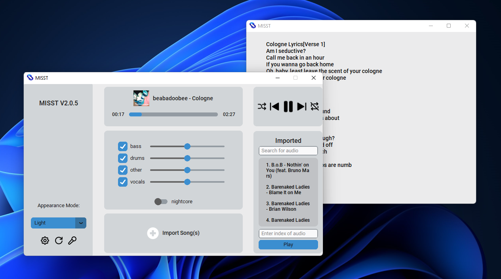
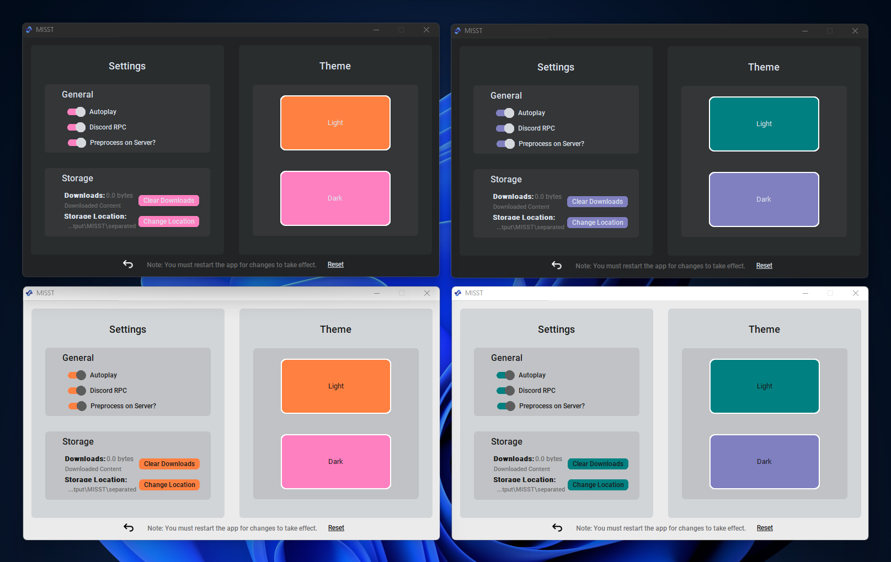

    

---

| _`MISST` on Windows 11 with Dark mode and 'Blue' theme with 'Kanye West's All of The Lights' playing_

| _`MISST` on Windows 11 with Light mode and 'Blue' theme with 'Beabadoobee's Cologne' playing_

| _`MISST` on Windows 11 Showcasing how versatile and personal you can be with MISST!_

###

Original Repository of MISST : **M**usic/**I**nstrumental **S**tem **S**eparation **T**ool.

This application uses state-of-the-art source separation models to extract the 4 core stems from audio files (Bass, Drums, Other Instrumentals and Vocals). But it is not limited to this. MISST acts as a developped music player aswell, fit to enjoy and medal with your audio files as you see fit. MISST even comes prepared to import songs and playlists directly from your music library.

This project is OpenSource, feel free to use, study and/or send pull request.

## Objectives:
- [x] Import songs and playlists from your music library
- [x] Play your songs and playlists
- [x] Extract and manipulate the 4 core stems from your audio files as they play
- [x] Save your stems as audio files
- [x] If imported from your music library, view lyrics and metadata just as you would in your old music player
- [x] Minimal memory usage
- [x] Customizable themes
- [x] Additional Efects like nightcore
- [ ] Easy to use equalizer (WIP)
- [ ] Preprocessing service available for offline use (WIP)
- [ ] Docker image (WIP)
- [ ] Make it as fast as possible (Preprocessing, Model loading, etc.) (Not a priority)
- [ ] Stable on Windows, Linux and MacOS (Not a priority)
- [x] Proper installer/updater

## Installation
as of version 2.0.6, MISST is not available for any platform with guaranteed compatibility. Until a later version, please refer to [Manual Installation](https://github.com/Frikallo/MISST/#manual-installation-for-developers). 

### Issue Reporting

Please be as detailed as possible when posting a new issue. 

If possible, check the "MISST.log" file in your install directory for detailed error information that can be provided to me.

## License

The **MISST** code is [GPL-licensed](LICENSE). 

- **Please Note:** For all third-party application developers who wish to use our models, please honor the GPL license by providing credit to MISST and its developer.

## Contributing

- For anyone interested in the ongoing development of **MISST**, please send us a pull request, and we will review it. 
- This project is 100% open-source and free for anyone to use and modify as they wish. 
- We only maintain the development and support for the **MISST** and the models provided. 

## More documentation to come...
