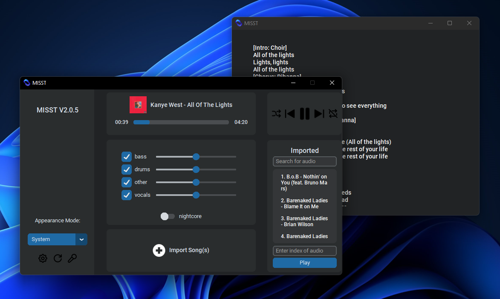
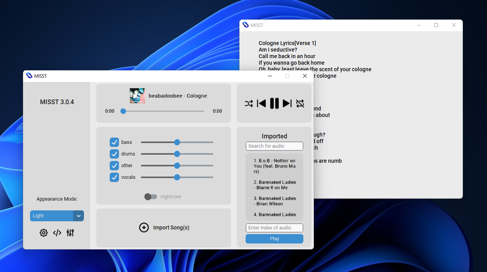
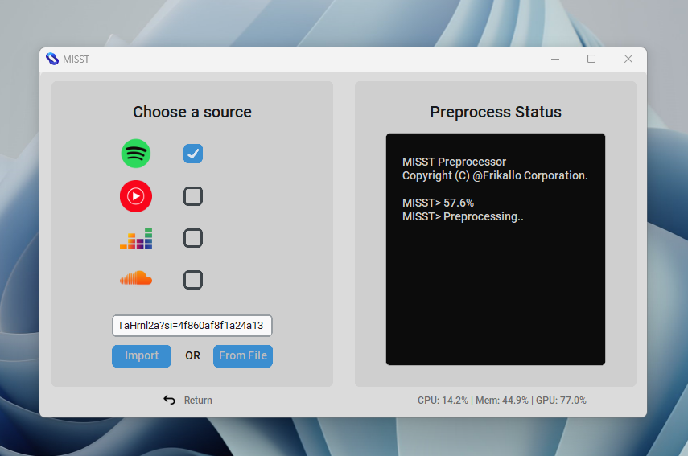

<div align="center">

[](https://github.com/Frikallo/MISST)
[](https://github.com/Frikallo/MISST/releases/latest) [](https://github.com/Frikallo/MISST/releases/latest) [](https://github.com/Frikallo/MISST/blob/main/LICENSE) [](https://github.com/Frikallo/MISST/graphs/contributors)

</div>

---


| _`MISST` on Windows 11 with Dark mode and 'Blue' theme with 'Steve Lacy's Infrunami' playing_


| _`MISST` on Windows 11 with Light mode and 'Blue' theme with 'Frank Ocean's Ivy' playing_


| _`MISST` on Windows 11 Showcasing how versatile and personal you can be with MISST!_


| _`MISST` on Windows 11 Showcasing how importing audios is as easy as two clicks!_

###

Original Repository of MISST : **M**usic/**I**nstrumental **S**tem **S**eparation **T**ool.

This application uses state-of-the-art [demucs](https://github.com/facebookresearch/demucs) source separation models to extract the 4 core stems from audio files (Bass, Drums, Other Instrumentals and Vocals). But it is not limited to this. MISST acts as a developped music player aswell, fit to enjoy and medal with your audio files as you see fit. MISST even comes prepared to import songs and playlists directly from your music library.

This project is OpenSource, feel free to use, study and/or send pull request.

## Objectives:
- [x] Import songs and playlists from your music library
- [x] Easy to use UI
- [x] Play your songs and playlists
- [x] Extract and manipulate the 4 core stems from your audio files as they play
- [x] Discord rich presence to show off your music to your friends
- [x] Save your stems as audio files
- [x] If imported from your music library, view lyrics and metadata just as you would in your old music player
- [x] Minimal memory usage
- [x] Customizable themes
- [x] Additional Efects like nightcore
- [x] Easy to use equalizer
- [x] Preprocessing service available on both CPU and GPU
- [x] Ability to change the pre-trained model used for separation
- [x] Small save size, comparable to the size of the inputted audio
- [ ] Docker image (WIP)
- [ ] Stable on Windows, Linux and MacOS (WIP)
- [ ] Proper installer/updater (Not a priority)

## Installation
As of version 3.1.0, MISST is only available on windows with guaranteed compatibility. 

Until a later release : 
- if you are **not on a windows device** please refer to [Manual Installation](https://github.com/Frikallo/MISST/#manual-installation).
- if you are **using conda on MacOs** device please refer to [Manual Installation - MacOS](https://github.com/CAprogs/MISST/blob/main/Installation%20Guide%20-%20MacOS.md)
-   Otherwise, refer to the latest [Release](https://github.com/Frikallo/MISST/releases/latest)

## Manual Installation
These instructions are for those installing MISST v3.1.0 **manually** only.

1. Download & install Python 3.9 or higher (but no lower than 3.9.0) [here](https://www.python.org/downloads/)
    - **Note:** Ensure the *"Add Python to PATH"* box is checked
2. Download the Source code [here](https://github.com/Frikallo/MISST/releases/latest)
3. Open the command prompt from the MISST directory and run the following commands, separately - 

```
$ python3 -m venv ./venv
$ pip install -r requirements.txt
$ python3 MISSTapp.py
```
- **Note:** Install `requirements-minimal.txt` if you don't intend to accelerate preprocessing with your GPU.

From here you should be able to open and run the MISSTapp.py file

- CUDA 

    - CUDA must be installed and configured for the application to process any track with GPU acceleration. You will need to look up instruction on how to configure it on your operating system. Click [here](https://developer.nvidia.com/cuda-downloads) for nvidia's installation guide.

## Benchmark

The audio processing performance was evaluated using an **NVIDIA GeForce RTX 2070 SUPER** with **8GB VRAM** and an **AMD Ryzen 3700X 8-Core Processor** on the htdemucs pretrained model. This test aimed to compare the processing time of audio on a CPU versus a GPU.

Here are the results of the test:

| Source                                                           | Source Length | CPU       | GPU       | Model     |
|------------------------------------------------------------------|---------------|-----------|-----------| --------- |
| [Frank Ocean - Ivy](https://www.youtube.com/watch?v=AE005nZeF-A) | 4m 09.00s     | 2m 22.16s | 0m 28.04s | htdemucs  |

## Demo

https://github.com/Frikallo/MISST/assets/88942100/15fb7ce3-9f83-4228-9ab0-f453593be632

[Open in YouTube](https://www.youtube.com/watch?v=XYJm5WW9Zvs)

## License

The **MISST** code is [GPL-licensed](LICENSE). 

- **Please Note:** For all third-party application developers who wish to use MISST or its code, please honor the GPL license by providing credit to MISST and its developer.

## Issue Reporting

Please be as detailed as possible when posting a new issue. 

If possible, check the "MISST.log" file in your install directory for detailed error information that can be provided to me.

## Contributing

- For anyone interested in the ongoing development of **MISST**, please send us a pull request, and I will review it. 
- This project is 100% open-source and free for anyone to use and modify as they wish. 
- I only maintain the development for **MISST** and the models provided. 

## More documentation to come...
